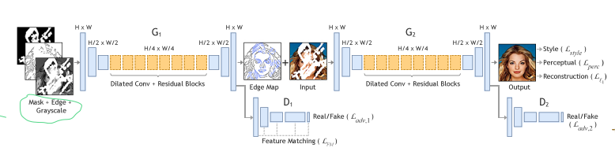
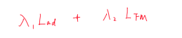
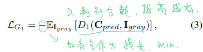
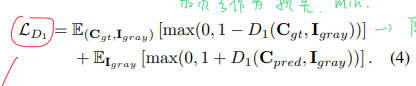
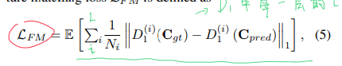
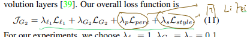
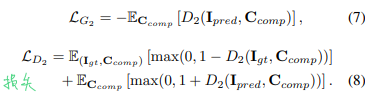
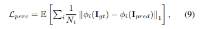
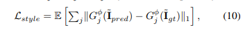
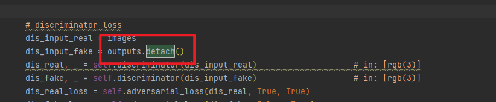

# EdgeConnect

## 1. 简介：

本文分将图像修复过程分成两个部分：先重建污损部分的边缘信息，而后在已有边缘的基础上重建高频细节。

边缘信息使用Canny进行提取，边缘生成网络和图像重建网络均使用GAN架构。

## 2. 相关论文：

本文中的生成模型结构使用该论文中的结构：[Perceptual Losses for Real-Time Style Transfer](../included module/Perceptual Losses for Real-Time Style Transfer.md)

本文中的判别模型结构使用该论文中的结构：[Image-to-Image Translation with Conditional Adversarial Networks](../included module/Image-to-Image Translation with Conditional Adversarial Networks.md)

## 3. 模型架构



### 1. 边缘生成网络

#### 1. 损失：

总损失：



对抗损失：





特征损失：



​	注意该特征损失与标准特征损失的区别在于，不在预训练好的其他模型中取输出，而是在 D1 上去每一层的输出计算 L1 损失。因为在ImageNet上预训练的模型不能很好地处理边缘信息。

##### 1. 生成器：

```python
# adv loss 对抗损失
gen_input_fake = torch.cat((images, outputs), dim=1)
gen_fake, gen_fake_feat = self.discriminator(gen_input_fake)   
gen_gan_loss = self.adversarial_loss(gen_fake, True, False)
gen_loss += gen_gan_loss
# adversarial_loss() 就是 nn.BCELoss()

# FM loss 对所有层输出计算L1
gen_fm_loss = 0
for i in range(len(dis_real_feat)):
    gen_fm_loss += self.l1_loss(gen_fake_feat[i], dis_real_feat[i].detach())
    gen_fm_loss = gen_fm_loss * self.config.FM_LOSS_WEIGHT
    gen_loss += gen_fm_loss
```

##### 2. 判别器：

```python
# discriminator loss
dis_input_real = torch.cat((images, edges), dim=1)
dis_input_fake = torch.cat((images, outputs.detach()), dim=1)
dis_real, dis_real_feat = self.discriminator(dis_input_real)        # in: (grayscale(1) + edge(1))
dis_fake, dis_fake_feat = self.discriminator(dis_input_fake)        # in: (grayscale(1) + edge(1))
dis_real_loss = self.adversarial_loss(dis_real, True, True)
dis_fake_loss = self.adversarial_loss(dis_fake, False, True)
dis_loss += (dis_real_loss + dis_fake_loss) / 2
```


#### 2. 结构：

##### 1. 生成器：

```python
# generator input: 
# [grayscale(1) + edge(1) + mask(1)]
# (3,256,256)
D:\app\Anaconda\envs\python364\python.exe D:/workspace/Python/edge-connect/src/networks.py
EdgeGenerator(
  (encoder): Sequential(
    (0): ReflectionPad2d((3, 3, 3, 3))
    (1): Conv2d(3, 64, kernel_size=(7, 7), stride=(1, 1))
    (2): InstanceNorm2d(64, eps=1e-05, momentum=0.1, affine=False, track_running_stats=False)
    (3): ReLU(inplace=True)
    (4): Conv2d(64, 128, kernel_size=(4, 4), stride=(2, 2), padding=(1, 1))
    (5): InstanceNorm2d(128, eps=1e-05, momentum=0.1, affine=False, track_running_stats=False)
    (6): ReLU(inplace=True)
    (7): Conv2d(128, 256, kernel_size=(4, 4), stride=(2, 2), padding=(1, 1))
    (8): InstanceNorm2d(256, eps=1e-05, momentum=0.1, affine=False, track_running_stats=False)
    (9): ReLU(inplace=True)
  )
  (middle): Sequential(
    (0): ResnetBlock(
      (conv_block): Sequential(
        (0): ReflectionPad2d((2, 2, 2, 2))
        (1): Conv2d(256, 256, kernel_size=(3, 3), stride=(1, 1), dilation=(2, 2), bias=False)
        (2): InstanceNorm2d(256, eps=1e-05, momentum=0.1, affine=False, track_running_stats=False)
        (3): ReLU(inplace=True)
        (4): ReflectionPad2d((1, 1, 1, 1))
        (5): Conv2d(256, 256, kernel_size=(3, 3), stride=(1, 1), bias=False)
        (6): InstanceNorm2d(256, eps=1e-05, momentum=0.1, affine=False, track_running_stats=False)
      )
    )
    (1): ResnetBlock(
      (conv_block): Sequential(
        (0): ReflectionPad2d((2, 2, 2, 2))
        (1): Conv2d(256, 256, kernel_size=(3, 3), stride=(1, 1), dilation=(2, 2), bias=False)
        (2): InstanceNorm2d(256, eps=1e-05, momentum=0.1, affine=False, track_running_stats=False)
        (3): ReLU(inplace=True)
        (4): ReflectionPad2d((1, 1, 1, 1))
        (5): Conv2d(256, 256, kernel_size=(3, 3), stride=(1, 1), bias=False)
        (6): InstanceNorm2d(256, eps=1e-05, momentum=0.1, affine=False, track_running_stats=False)
      )
    )
    (2): ResnetBlock(
      (conv_block): Sequential(
        (0): ReflectionPad2d((2, 2, 2, 2))
        (1): Conv2d(256, 256, kernel_size=(3, 3), stride=(1, 1), dilation=(2, 2), bias=False)
        (2): InstanceNorm2d(256, eps=1e-05, momentum=0.1, affine=False, track_running_stats=False)
        (3): ReLU(inplace=True)
        (4): ReflectionPad2d((1, 1, 1, 1))
        (5): Conv2d(256, 256, kernel_size=(3, 3), stride=(1, 1), bias=False)
        (6): InstanceNorm2d(256, eps=1e-05, momentum=0.1, affine=False, track_running_stats=False)
      )
    )
    (3): ResnetBlock(
      (conv_block): Sequential(
        (0): ReflectionPad2d((2, 2, 2, 2))
        (1): Conv2d(256, 256, kernel_size=(3, 3), stride=(1, 1), dilation=(2, 2), bias=False)
        (2): InstanceNorm2d(256, eps=1e-05, momentum=0.1, affine=False, track_running_stats=False)
        (3): ReLU(inplace=True)
        (4): ReflectionPad2d((1, 1, 1, 1))
        (5): Conv2d(256, 256, kernel_size=(3, 3), stride=(1, 1), bias=False)
        (6): InstanceNorm2d(256, eps=1e-05, momentum=0.1, affine=False, track_running_stats=False)
      )
    )
    (4): ResnetBlock(
      (conv_block): Sequential(
        (0): ReflectionPad2d((2, 2, 2, 2))
        (1): Conv2d(256, 256, kernel_size=(3, 3), stride=(1, 1), dilation=(2, 2), bias=False)
        (2): InstanceNorm2d(256, eps=1e-05, momentum=0.1, affine=False, track_running_stats=False)
        (3): ReLU(inplace=True)
        (4): ReflectionPad2d((1, 1, 1, 1))
        (5): Conv2d(256, 256, kernel_size=(3, 3), stride=(1, 1), bias=False)
        (6): InstanceNorm2d(256, eps=1e-05, momentum=0.1, affine=False, track_running_stats=False)
      )
    )
    (5): ResnetBlock(
      (conv_block): Sequential(
        (0): ReflectionPad2d((2, 2, 2, 2))
        (1): Conv2d(256, 256, kernel_size=(3, 3), stride=(1, 1), dilation=(2, 2), bias=False)
        (2): InstanceNorm2d(256, eps=1e-05, momentum=0.1, affine=False, track_running_stats=False)
        (3): ReLU(inplace=True)
        (4): ReflectionPad2d((1, 1, 1, 1))
        (5): Conv2d(256, 256, kernel_size=(3, 3), stride=(1, 1), bias=False)
        (6): InstanceNorm2d(256, eps=1e-05, momentum=0.1, affine=False, track_running_stats=False)
      )
    )
    (6): ResnetBlock(
      (conv_block): Sequential(
        (0): ReflectionPad2d((2, 2, 2, 2))
        (1): Conv2d(256, 256, kernel_size=(3, 3), stride=(1, 1), dilation=(2, 2), bias=False)
        (2): InstanceNorm2d(256, eps=1e-05, momentum=0.1, affine=False, track_running_stats=False)
        (3): ReLU(inplace=True)
        (4): ReflectionPad2d((1, 1, 1, 1))
        (5): Conv2d(256, 256, kernel_size=(3, 3), stride=(1, 1), bias=False)
        (6): InstanceNorm2d(256, eps=1e-05, momentum=0.1, affine=False, track_running_stats=False)
      )
    )
    (7): ResnetBlock(
      (conv_block): Sequential(
        (0): ReflectionPad2d((2, 2, 2, 2))
        (1): Conv2d(256, 256, kernel_size=(3, 3), stride=(1, 1), dilation=(2, 2), bias=False)
        (2): InstanceNorm2d(256, eps=1e-05, momentum=0.1, affine=False, track_running_stats=False)
        (3): ReLU(inplace=True)
        (4): ReflectionPad2d((1, 1, 1, 1))
        (5): Conv2d(256, 256, kernel_size=(3, 3), stride=(1, 1), bias=False)
        (6): InstanceNorm2d(256, eps=1e-05, momentum=0.1, affine=False, track_running_stats=False)
      )
    )
  )
  (decoder): Sequential(
    (0): ConvTranspose2d(256, 128, kernel_size=(4, 4), stride=(2, 2), padding=(1, 1))
    (1): InstanceNorm2d(128, eps=1e-05, momentum=0.1, affine=False, track_running_stats=False)
    (2): ReLU(inplace=True)
    (3): ConvTranspose2d(128, 64, kernel_size=(4, 4), stride=(2, 2), padding=(1, 1))
    (4): InstanceNorm2d(64, eps=1e-05, momentum=0.1, affine=False, track_running_stats=False)
    (5): ReLU(inplace=True)
    (6): ReflectionPad2d((3, 3, 3, 3))
    (7): Conv2d(64, 1, kernel_size=(7, 7), stride=(1, 1))
  )
)
===============================================================================================
Layer (type:depth-idx)                        Output Shape              Param #
===============================================================================================
├─Sequential: 1-1                             [-1, 256, 64, 64]         --
|    └─ReflectionPad2d: 2-1                   [-1, 3, 262, 262]         --
|    └─Conv2d: 2-2                            [-1, 64, 256, 256]        9,472
|    └─InstanceNorm2d: 2-3                    [-1, 64, 256, 256]        --
|    └─ReLU: 2-4                              [-1, 64, 256, 256]        --
|    └─Conv2d: 2-5                            [-1, 128, 128, 128]       131,200
|    └─InstanceNorm2d: 2-6                    [-1, 128, 128, 128]       --
|    └─ReLU: 2-7                              [-1, 128, 128, 128]       --
|    └─Conv2d: 2-8                            [-1, 256, 64, 64]         524,544
|    └─InstanceNorm2d: 2-9                    [-1, 256, 64, 64]         --
|    └─ReLU: 2-10                             [-1, 256, 64, 64]         --
├─Sequential: 1-2                             [-1, 256, 64, 64]         --
|    └─ResnetBlock: 2-11                      [-1, 256, 64, 64]         --
|    |    └─Sequential: 3-1                   [-1, 256, 64, 64]         1,179,648
|    └─ResnetBlock: 2-12                      [-1, 256, 64, 64]         --
|    |    └─Sequential: 3-2                   [-1, 256, 64, 64]         1,179,648
|    └─ResnetBlock: 2-13                      [-1, 256, 64, 64]         --
|    |    └─Sequential: 3-3                   [-1, 256, 64, 64]         1,179,648
|    └─ResnetBlock: 2-14                      [-1, 256, 64, 64]         --
|    |    └─Sequential: 3-4                   [-1, 256, 64, 64]         1,179,648
|    └─ResnetBlock: 2-15                      [-1, 256, 64, 64]         --
|    |    └─Sequential: 3-5                   [-1, 256, 64, 64]         1,179,648
|    └─ResnetBlock: 2-16                      [-1, 256, 64, 64]         --
|    |    └─Sequential: 3-6                   [-1, 256, 64, 64]         1,179,648
|    └─ResnetBlock: 2-17                      [-1, 256, 64, 64]         --
|    |    └─Sequential: 3-7                   [-1, 256, 64, 64]         1,179,648
|    └─ResnetBlock: 2-18                      [-1, 256, 64, 64]         --
|    |    └─Sequential: 3-8                   [-1, 256, 64, 64]         1,179,648
├─Sequential: 1-3                             [-1, 1, 256, 256]         --
|    └─ConvTranspose2d: 2-19                  [-1, 128, 128, 128]       524,416
|    └─InstanceNorm2d: 2-20                   [-1, 128, 128, 128]       --
|    └─ReLU: 2-21                             [-1, 128, 128, 128]       --
|    └─ConvTranspose2d: 2-22                  [-1, 64, 256, 256]        131,136
|    └─InstanceNorm2d: 2-23                   [-1, 64, 256, 256]        --
|    └─ReLU: 2-24                             [-1, 64, 256, 256]        --
|    └─ReflectionPad2d: 2-25                  [-1, 64, 262, 262]        --
|    └─Conv2d: 2-26                           [-1, 1, 256, 256]         3,137
===============================================================================================
Total params: 10,761,089
Trainable params: 10,761,089
Non-trainable params: 0
Total mult-adds (M): 245.91
===============================================================================================
Input size (MB): 0.75
Forward/backward pass size (MB): 232.50
Params size (MB): 41.05
Estimated Total Size (MB): 274.30
===============================================================================================
```

##### 2. 判别器：

```python
# discriminator input: 
# (grayscale(1) + edge(1))
# (2,256,256
D:\app\Anaconda\envs\python364\python.exe D:/workspace/Python/edge-connect/src/networks.py
Discriminator(
  (conv1): Sequential(
    (0): Conv2d(2, 64, kernel_size=(4, 4), stride=(2, 2), padding=(1, 1), bias=False)
    (1): LeakyReLU(negative_slope=0.2, inplace=True)
  )
  (features): Sequential(
    (0): Conv2d(2, 64, kernel_size=(4, 4), stride=(2, 2), padding=(1, 1), bias=False)
    (1): LeakyReLU(negative_slope=0.2, inplace=True)
  )
  (conv2): Sequential(
    (0): Conv2d(64, 128, kernel_size=(4, 4), stride=(2, 2), padding=(1, 1), bias=False)
    (1): LeakyReLU(negative_slope=0.2, inplace=True)
  )
  (conv3): Sequential(
    (0): Conv2d(128, 256, kernel_size=(4, 4), stride=(2, 2), padding=(1, 1), bias=False)
    (1): LeakyReLU(negative_slope=0.2, inplace=True)
  )
  (conv4): Sequential(
    (0): Conv2d(256, 512, kernel_size=(4, 4), stride=(1, 1), padding=(1, 1), bias=False)
    (1): LeakyReLU(negative_slope=0.2, inplace=True)
  )
  (conv5): Sequential(
    (0): Conv2d(512, 1, kernel_size=(4, 4), stride=(1, 1), padding=(1, 1), bias=False)
  )
)
==========================================================================================
Layer (type:depth-idx)                   Output Shape              Param #
==========================================================================================
├─Sequential: 1-1                        [-1, 64, 128, 128]        --
|    └─Conv2d: 2-1                       [-1, 64, 128, 128]        2,048
|    └─LeakyReLU: 2-2                    [-1, 64, 128, 128]        --
├─Sequential: 1-2                        [-1, 128, 64, 64]         --
|    └─Conv2d: 2-3                       [-1, 128, 64, 64]         131,072
|    └─LeakyReLU: 2-4                    [-1, 128, 64, 64]         --
├─Sequential: 1-3                        [-1, 256, 32, 32]         --
|    └─Conv2d: 2-5                       [-1, 256, 32, 32]         524,288
|    └─LeakyReLU: 2-6                    [-1, 256, 32, 32]         --
├─Sequential: 1-4                        [-1, 512, 31, 31]         --
|    └─Conv2d: 2-7                       [-1, 512, 31, 31]         2,097,152
|    └─LeakyReLU: 2-8                    [-1, 512, 31, 31]         --
├─Sequential: 1-5                        [-1, 1, 30, 30]           --
|    └─Conv2d: 2-9                       [-1, 1, 30, 30]           8,192
==========================================================================================
Total params: 2,762,752
Trainable params: 2,762,752
Non-trainable params: 0
Total mult-adds (M): 5.53
==========================================================================================
Input size (MB): 0.50
Forward/backward pass size (MB): 17.76
Params size (MB): 10.54
Estimated Total Size (MB): 28.80
==========================================================================================
```

### 2. 图像生成网络

#### 1. 损失：

总损失：



对抗损失：



感知损失：

​	使用预训练模型的指定层算 L1。



样式损失：

​	使用预训练模型的指定层算Gram矩阵 L1



##### 1. 判别器：

```python
# discriminator loss
dis_input_real = images
dis_input_fake = outputs.detach()
dis_real, _ = self.discriminator(dis_input_real)                    # in: [rgb(3)]
dis_fake, _ = self.discriminator(dis_input_fake)                    # in: [rgb(3)]
dis_real_loss = self.adversarial_loss(dis_real, True, True)
dis_fake_loss = self.adversarial_loss(dis_fake, False, True)
dis_loss += (dis_real_loss + dis_fake_loss) / 2
```

##### 2. 生成器：

```python
# generator adversarial loss
gen_input_fake = outputs
gen_fake, _ = self.discriminator(gen_input_fake)                    # in: [rgb(3)]
gen_gan_loss = self.adversarial_loss(gen_fake, True, False) * self.config.INPAINT_ADV_LOSS_WEIGHT
gen_loss += gen_gan_loss


# generator l1 loss
gen_l1_loss = self.l1_loss(outputs, images) * self.config.L1_LOSS_WEIGHT / torch.mean(masks)
gen_loss += gen_l1_loss


# generator perceptual loss
gen_content_loss = self.perceptual_loss(outputs, images)
gen_content_loss = gen_content_loss * self.config.CONTENT_LOSS_WEIGHT
gen_loss += gen_content_loss


# generator style loss
gen_style_loss = self.style_loss(outputs * masks, images * masks)
gen_style_loss = gen_style_loss * self.config.STYLE_LOSS_WEIGHT
gen_loss += gen_style_loss
```

其中，perceptual loss 定义为：

```python
class PerceptualLoss(nn.Module):


    def __init__(self, weights=[1.0, 1.0, 1.0, 1.0, 1.0]):
        super(PerceptualLoss, self).__init__()
        self.add_module('vgg', VGG19())
        self.criterion = torch.nn.L1Loss()
        self.weights = weights

    def __call__(self, x, y):
        # Compute features
        x_vgg, y_vgg = self.vgg(x), self.vgg(y)

        content_loss = 0.0
        content_loss += self.weights[0] * self.criterion(x_vgg['relu1_1'], y_vgg['relu1_1'])
        content_loss += self.weights[1] * self.criterion(x_vgg['relu2_1'], y_vgg['relu2_1'])
        content_loss += self.weights[2] * self.criterion(x_vgg['relu3_1'], y_vgg['relu3_1'])
        content_loss += self.weights[3] * self.criterion(x_vgg['relu4_1'], y_vgg['relu4_1'])
        content_loss += self.weights[4] * self.criterion(x_vgg['relu5_1'], y_vgg['relu5_1'])


        return content_loss


```

style loss 定义为：

```python
class StyleLoss(nn.Module):
    
    def __init__(self):
        super(StyleLoss, self).__init__()
        self.add_module('vgg', VGG19())
        self.criterion = torch.nn.L1Loss()

    def compute_gram(self, x):
        b, ch, h, w = x.size()
        f = x.view(b, ch, w * h)
        f_T = f.transpose(1, 2)
        G = f.bmm(f_T) / (h * w * ch)

        return G

    def __call__(self, x, y):
        # Compute features
        x_vgg, y_vgg = self.vgg(x), self.vgg(y)

        # Compute loss
        style_loss = 0.0
        style_loss += self.criterion(self.compute_gram(x_vgg['relu2_2']), self.compute_gram(y_vgg['relu2_2']))
        style_loss += self.criterion(self.compute_gram(x_vgg['relu3_4']), self.compute_gram(y_vgg['relu3_4']))
        style_loss += self.criterion(self.compute_gram(x_vgg['relu4_4']), self.compute_gram(y_vgg['relu4_4']))
        style_loss += self.criterion(self.compute_gram(x_vgg['relu5_2']), self.compute_gram(y_vgg['relu5_2']))

        return style_loss
```

#### 2. 结构：

##### 1. 生成器：

```python
# generator input: 
# [rgb(3) + edge(1)]
# (4,256,256)
InpaintGenerator(
  (encoder): Sequential(
    (0): ReflectionPad2d((3, 3, 3, 3))
    (1): Conv2d(4, 64, kernel_size=(7, 7), stride=(1, 1))
    (2): InstanceNorm2d(64, eps=1e-05, momentum=0.1, affine=False, track_running_stats=False)
    (3): ReLU(inplace=True)
    (4): Conv2d(64, 128, kernel_size=(4, 4), stride=(2, 2), padding=(1, 1))
    (5): InstanceNorm2d(128, eps=1e-05, momentum=0.1, affine=False, track_running_stats=False)
    (6): ReLU(inplace=True)
    (7): Conv2d(128, 256, kernel_size=(4, 4), stride=(2, 2), padding=(1, 1))
    (8): InstanceNorm2d(256, eps=1e-05, momentum=0.1, affine=False, track_running_stats=False)
    (9): ReLU(inplace=True)
  )
  (middle): Sequential(
    (0): ResnetBlock(
      (conv_block): Sequential(
        (0): ReflectionPad2d((2, 2, 2, 2))
        (1): Conv2d(256, 256, kernel_size=(3, 3), stride=(1, 1), dilation=(2, 2))
        (2): InstanceNorm2d(256, eps=1e-05, momentum=0.1, affine=False, track_running_stats=False)
        (3): ReLU(inplace=True)
        (4): ReflectionPad2d((1, 1, 1, 1))
        (5): Conv2d(256, 256, kernel_size=(3, 3), stride=(1, 1))
        (6): InstanceNorm2d(256, eps=1e-05, momentum=0.1, affine=False, track_running_stats=False)
      )
    )
    (1): ResnetBlock(
      (conv_block): Sequential(
        (0): ReflectionPad2d((2, 2, 2, 2))
        (1): Conv2d(256, 256, kernel_size=(3, 3), stride=(1, 1), dilation=(2, 2))
        (2): InstanceNorm2d(256, eps=1e-05, momentum=0.1, affine=False, track_running_stats=False)
        (3): ReLU(inplace=True)
        (4): ReflectionPad2d((1, 1, 1, 1))
        (5): Conv2d(256, 256, kernel_size=(3, 3), stride=(1, 1))
        (6): InstanceNorm2d(256, eps=1e-05, momentum=0.1, affine=False, track_running_stats=False)
      )
    )
    (2): ResnetBlock(
      (conv_block): Sequential(
        (0): ReflectionPad2d((2, 2, 2, 2))
        (1): Conv2d(256, 256, kernel_size=(3, 3), stride=(1, 1), dilation=(2, 2))
        (2): InstanceNorm2d(256, eps=1e-05, momentum=0.1, affine=False, track_running_stats=False)
        (3): ReLU(inplace=True)
        (4): ReflectionPad2d((1, 1, 1, 1))
        (5): Conv2d(256, 256, kernel_size=(3, 3), stride=(1, 1))
        (6): InstanceNorm2d(256, eps=1e-05, momentum=0.1, affine=False, track_running_stats=False)
      )
    )
    (3): ResnetBlock(
      (conv_block): Sequential(
        (0): ReflectionPad2d((2, 2, 2, 2))
        (1): Conv2d(256, 256, kernel_size=(3, 3), stride=(1, 1), dilation=(2, 2))
        (2): InstanceNorm2d(256, eps=1e-05, momentum=0.1, affine=False, track_running_stats=False)
        (3): ReLU(inplace=True)
        (4): ReflectionPad2d((1, 1, 1, 1))
        (5): Conv2d(256, 256, kernel_size=(3, 3), stride=(1, 1))
        (6): InstanceNorm2d(256, eps=1e-05, momentum=0.1, affine=False, track_running_stats=False)
      )
    )
    (4): ResnetBlock(
      (conv_block): Sequential(
        (0): ReflectionPad2d((2, 2, 2, 2))
        (1): Conv2d(256, 256, kernel_size=(3, 3), stride=(1, 1), dilation=(2, 2))
        (2): InstanceNorm2d(256, eps=1e-05, momentum=0.1, affine=False, track_running_stats=False)
        (3): ReLU(inplace=True)
        (4): ReflectionPad2d((1, 1, 1, 1))
        (5): Conv2d(256, 256, kernel_size=(3, 3), stride=(1, 1))
        (6): InstanceNorm2d(256, eps=1e-05, momentum=0.1, affine=False, track_running_stats=False)
      )
    )
    (5): ResnetBlock(
      (conv_block): Sequential(
        (0): ReflectionPad2d((2, 2, 2, 2))
        (1): Conv2d(256, 256, kernel_size=(3, 3), stride=(1, 1), dilation=(2, 2))
        (2): InstanceNorm2d(256, eps=1e-05, momentum=0.1, affine=False, track_running_stats=False)
        (3): ReLU(inplace=True)
        (4): ReflectionPad2d((1, 1, 1, 1))
        (5): Conv2d(256, 256, kernel_size=(3, 3), stride=(1, 1))
        (6): InstanceNorm2d(256, eps=1e-05, momentum=0.1, affine=False, track_running_stats=False)
      )
    )
    (6): ResnetBlock(
      (conv_block): Sequential(
        (0): ReflectionPad2d((2, 2, 2, 2))
        (1): Conv2d(256, 256, kernel_size=(3, 3), stride=(1, 1), dilation=(2, 2))
        (2): InstanceNorm2d(256, eps=1e-05, momentum=0.1, affine=False, track_running_stats=False)
        (3): ReLU(inplace=True)
        (4): ReflectionPad2d((1, 1, 1, 1))
        (5): Conv2d(256, 256, kernel_size=(3, 3), stride=(1, 1))
        (6): InstanceNorm2d(256, eps=1e-05, momentum=0.1, affine=False, track_running_stats=False)
      )
    )
    (7): ResnetBlock(
      (conv_block): Sequential(
        (0): ReflectionPad2d((2, 2, 2, 2))
        (1): Conv2d(256, 256, kernel_size=(3, 3), stride=(1, 1), dilation=(2, 2))
        (2): InstanceNorm2d(256, eps=1e-05, momentum=0.1, affine=False, track_running_stats=False)
        (3): ReLU(inplace=True)
        (4): ReflectionPad2d((1, 1, 1, 1))
        (5): Conv2d(256, 256, kernel_size=(3, 3), stride=(1, 1))
        (6): InstanceNorm2d(256, eps=1e-05, momentum=0.1, affine=False, track_running_stats=False)
      )
    )
  )
  (decoder): Sequential(
    (0): ConvTranspose2d(256, 128, kernel_size=(4, 4), stride=(2, 2), padding=(1, 1))
    (1): InstanceNorm2d(128, eps=1e-05, momentum=0.1, affine=False, track_running_stats=False)
    (2): ReLU(inplace=True)
    (3): ConvTranspose2d(128, 64, kernel_size=(4, 4), stride=(2, 2), padding=(1, 1))
    (4): InstanceNorm2d(64, eps=1e-05, momentum=0.1, affine=False, track_running_stats=False)
    (5): ReLU(inplace=True)
    (6): ReflectionPad2d((3, 3, 3, 3))
    (7): Conv2d(64, 3, kernel_size=(7, 7), stride=(1, 1))
  )
)
===============================================================================================
Layer (type:depth-idx)                        Output Shape              Param #
===============================================================================================
├─Sequential: 1-1                             [-1, 256, 64, 64]         --
|    └─ReflectionPad2d: 2-1                   [-1, 4, 262, 262]         --
|    └─Conv2d: 2-2                            [-1, 64, 256, 256]        12,608
|    └─InstanceNorm2d: 2-3                    [-1, 64, 256, 256]        --
|    └─ReLU: 2-4                              [-1, 64, 256, 256]        --
|    └─Conv2d: 2-5                            [-1, 128, 128, 128]       131,200
|    └─InstanceNorm2d: 2-6                    [-1, 128, 128, 128]       --
|    └─ReLU: 2-7                              [-1, 128, 128, 128]       --
|    └─Conv2d: 2-8                            [-1, 256, 64, 64]         524,544
|    └─InstanceNorm2d: 2-9                    [-1, 256, 64, 64]         --
|    └─ReLU: 2-10                             [-1, 256, 64, 64]         --
├─Sequential: 1-2                             [-1, 256, 64, 64]         --
|    └─ResnetBlock: 2-11                      [-1, 256, 64, 64]         --
|    |    └─Sequential: 3-1                   [-1, 256, 64, 64]         1,180,160
|    └─ResnetBlock: 2-12                      [-1, 256, 64, 64]         --
|    |    └─Sequential: 3-2                   [-1, 256, 64, 64]         1,180,160
|    └─ResnetBlock: 2-13                      [-1, 256, 64, 64]         --
|    |    └─Sequential: 3-3                   [-1, 256, 64, 64]         1,180,160
|    └─ResnetBlock: 2-14                      [-1, 256, 64, 64]         --
|    |    └─Sequential: 3-4                   [-1, 256, 64, 64]         1,180,160
|    └─ResnetBlock: 2-15                      [-1, 256, 64, 64]         --
|    |    └─Sequential: 3-5                   [-1, 256, 64, 64]         1,180,160
|    └─ResnetBlock: 2-16                      [-1, 256, 64, 64]         --
|    |    └─Sequential: 3-6                   [-1, 256, 64, 64]         1,180,160
|    └─ResnetBlock: 2-17                      [-1, 256, 64, 64]         --
|    |    └─Sequential: 3-7                   [-1, 256, 64, 64]         1,180,160
|    └─ResnetBlock: 2-18                      [-1, 256, 64, 64]         --
|    |    └─Sequential: 3-8                   [-1, 256, 64, 64]         1,180,160
├─Sequential: 1-3                             [-1, 3, 256, 256]         --
|    └─ConvTranspose2d: 2-19                  [-1, 128, 128, 128]       524,416
|    └─InstanceNorm2d: 2-20                   [-1, 128, 128, 128]       --
|    └─ReLU: 2-21                             [-1, 128, 128, 128]       --
|    └─ConvTranspose2d: 2-22                  [-1, 64, 256, 256]        131,136
|    └─InstanceNorm2d: 2-23                   [-1, 64, 256, 256]        --
|    └─ReLU: 2-24                             [-1, 64, 256, 256]        --
|    └─ReflectionPad2d: 2-25                  [-1, 64, 262, 262]        --
|    └─Conv2d: 2-26                           [-1, 3, 256, 256]         9,411
===============================================================================================
Total params: 10,774,595
Trainable params: 10,774,595
Non-trainable params: 0
Total mult-adds (G): 61.60
===============================================================================================
Input size (MB): 1.00
Forward/backward pass size (MB): 233.50
Params size (MB): 41.10
Estimated Total Size (MB): 275.60
===============================================================================================
```

##### 2. 判别器：

```python
# discriminator input: 
# [rgb(3)]
# (3,256,256)
Discriminator(
  (conv1): Sequential(
    (0): Conv2d(3, 64, kernel_size=(4, 4), stride=(2, 2), padding=(1, 1), bias=False)
    (1): LeakyReLU(negative_slope=0.2, inplace=True)
  )
  (features): Sequential(
    (0): Conv2d(3, 64, kernel_size=(4, 4), stride=(2, 2), padding=(1, 1), bias=False)
    (1): LeakyReLU(negative_slope=0.2, inplace=True)
  )
  (conv2): Sequential(
    (0): Conv2d(64, 128, kernel_size=(4, 4), stride=(2, 2), padding=(1, 1), bias=False)
    (1): LeakyReLU(negative_slope=0.2, inplace=True)
  )
  (conv3): Sequential(
    (0): Conv2d(128, 256, kernel_size=(4, 4), stride=(2, 2), padding=(1, 1), bias=False)
    (1): LeakyReLU(negative_slope=0.2, inplace=True)
  )
  (conv4): Sequential(
    (0): Conv2d(256, 512, kernel_size=(4, 4), stride=(1, 1), padding=(1, 1), bias=False)
    (1): LeakyReLU(negative_slope=0.2, inplace=True)
  )
  (conv5): Sequential(
    (0): Conv2d(512, 1, kernel_size=(4, 4), stride=(1, 1), padding=(1, 1), bias=False)
  )
)
==========================================================================================
Layer (type:depth-idx)                   Output Shape              Param #
==========================================================================================
├─Sequential: 1-1                        [-1, 64, 128, 128]        --
|    └─Conv2d: 2-1                       [-1, 64, 128, 128]        3,072
|    └─LeakyReLU: 2-2                    [-1, 64, 128, 128]        --
├─Sequential: 1-2                        [-1, 128, 64, 64]         --
|    └─Conv2d: 2-3                       [-1, 128, 64, 64]         131,072
|    └─LeakyReLU: 2-4                    [-1, 128, 64, 64]         --
├─Sequential: 1-3                        [-1, 256, 32, 32]         --
|    └─Conv2d: 2-5                       [-1, 256, 32, 32]         524,288
|    └─LeakyReLU: 2-6                    [-1, 256, 32, 32]         --
├─Sequential: 1-4                        [-1, 512, 31, 31]         --
|    └─Conv2d: 2-7                       [-1, 512, 31, 31]         2,097,152
|    └─LeakyReLU: 2-8                    [-1, 512, 31, 31]         --
├─Sequential: 1-5                        [-1, 1, 30, 30]           --
|    └─Conv2d: 2-9                       [-1, 1, 30, 30]           8,192
==========================================================================================
Total params: 2,763,776
Trainable params: 2,763,776
Non-trainable params: 0
Total mult-adds (M): 5.53
==========================================================================================
Input size (MB): 0.75
Forward/backward pass size (MB): 17.76
Params size (MB): 10.54
Estimated Total Size (MB): 29.05
==========================================================================================
```


## 4. tips：

### 1. 为什么使用detach()



对生成器的output使用detach，使得生成器的参数在判别器的梯度下降时不会产生变化，从而起到单独训练生成器的效果。
