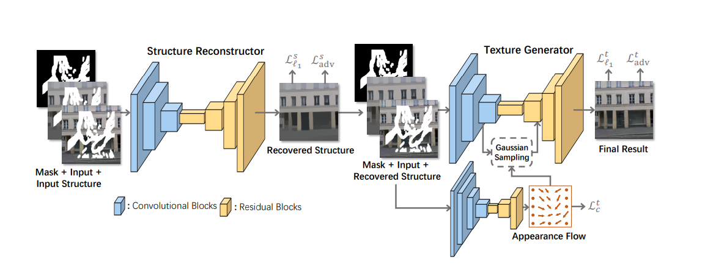
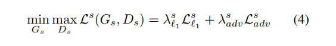
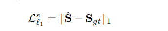
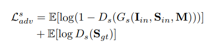
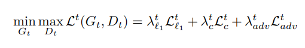
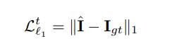
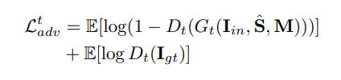
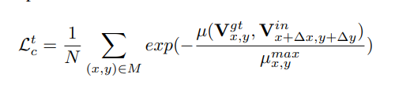
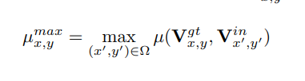

# StructureFlow: Image Inpainting via Structure-aware Appearance Flow

## 1. 简介：

本文提出了一个两段式的图像修复模型：首先修复缺失部分的结构信息，而后修复缺失部分的纹理细节。

与EdgeConnect模型相比，本文指出其Canny边缘信息提取不能将结构信息全部囊括，会存在大量的信息丢失，所以本文使用了edge-preserved smooth methods 方法来生成结构信息。

同时，在纹理细节生成过程中，本文引入了 Appearance Flow 作为损失的一部分，并将其中的双线性采样替换为高斯采样。

## 2. 相关论文：

本文中的结构信息生成方法RTV  [Structure extraction from texture via relative total variation.]() 

Appearance Flow 基础方法 [View synthesis by appearance flow.]()

判别器结构与 BicycleGAN [Toward multimodal image-to-image translation.]() 类似的两个 patch GAN

光谱归一化 [Spectral normalization for generative adversarial networks. ]() **纯数学有待进一步阅读！**，貌似是一个WGAN的优化，提供一个GAN中判别器的损失函数计算方法，用来比较两张图片的相似性。

## 3. 模型架构：



### 1. 结构重建器：

#### 1. 损失：

只使用了对抗损失和L1 损失。







#### 2. 结构:

##### 1. 生成器:

```python
# StructureGen (7,256,256) --> input[3], smooth[3], mask[1]
===============================================================================================
Layer (type:depth-idx)                        Output Shape              Param #
===============================================================================================
├─Conv2dBlock: 1-1                            [-1, 64, 256, 256]        --
|    └─ReflectionPad2d: 2-1                   [-1, 7, 262, 262]         --
|    └─Conv2d: 2-2                            [-1, 64, 256, 256]        22,016
|    └─InstanceNorm2d: 2-3                    [-1, 64, 256, 256]        --
|    └─ReLU: 2-4                              [-1, 64, 256, 256]        --
├─ModuleList: 1                               []                        --
|    └─Sequential: 2-5                        [-1, 128, 128, 128]       --
|    |    └─Conv2dBlock: 3-1                  [-1, 128, 128, 128]       131,200
|    |    └─Conv2dBlock: 3-2                  [-1, 128, 128, 128]       409,728
|    └─Sequential: 2-6                        [-1, 256, 64, 64]         --
|    |    └─Conv2dBlock: 3-3                  [-1, 256, 64, 64]         524,544
|    |    └─Conv2dBlock: 3-4                  [-1, 256, 64, 64]         1,638,656
|    └─Sequential: 2-7                        [-1, 512, 32, 32]         --
|    |    └─Conv2dBlock: 3-5                  [-1, 512, 32, 32]         2,097,664
├─ModuleList: 1                               []                        --
|    └─Sequential: 2-8                        [-1, 256, 64, 64]         --
|    |    └─ResBlocks: 3-6                    [-1, 512, 32, 32]         18,878,464
|    |    └─Upsample: 3-7                     [-1, 512, 64, 64]         --
|    |    └─Conv2dBlock: 3-8                  [-1, 256, 64, 64]         3,277,056
├─ModuleList: 1                               []                        --
|    └─Conv2dBlock: 2-9                       [-1, 256, 64, 64]         --
|    |    └─ReflectionPad2d: 3-9              [-1, 256, 68, 68]         --
|    |    └─Conv2d: 3-10                      [-1, 256, 64, 64]         1,638,656
|    |    └─InstanceNorm2d: 3-11              [-1, 256, 64, 64]         --
|    |    └─ReLU: 3-12                        [-1, 256, 64, 64]         --
├─ModuleList: 1                               []                        --
|    └─Sequential: 2-10                       [-1, 128, 128, 128]       --
|    |    └─ResBlocks: 3-13                   [-1, 256, 64, 64]         4,720,640
|    |    └─Upsample: 3-14                    [-1, 256, 128, 128]       --
|    |    └─Conv2dBlock: 3-15                 [-1, 128, 128, 128]       819,328
├─ModuleList: 1                               []                        --
|    └─Conv2dBlock: 2-11                      [-1, 128, 128, 128]       --
|    |    └─ReflectionPad2d: 3-16             [-1, 128, 132, 132]       --
|    |    └─Conv2d: 3-17                      [-1, 128, 128, 128]       409,728
|    |    └─InstanceNorm2d: 3-18              [-1, 128, 128, 128]       --
|    |    └─ReLU: 3-19                        [-1, 128, 128, 128]       --
├─ModuleList: 1                               []                        --
|    └─Sequential: 2-12                       [-1, 64, 256, 256]        --
|    |    └─ResBlocks: 3-20                   [-1, 128, 128, 128]       1,180,672
|    |    └─Upsample: 3-21                    [-1, 128, 256, 256]       --
|    |    └─Conv2dBlock: 3-22                 [-1, 64, 256, 256]        204,864
├─ModuleList: 1                               []                        --
|    └─Conv2dBlock: 2-13                      [-1, 64, 256, 256]        --
|    |    └─ReflectionPad2d: 3-23             [-1, 64, 260, 260]        --
|    |    └─Conv2d: 3-24                      [-1, 64, 256, 256]        102,464
|    |    └─InstanceNorm2d: 3-25              [-1, 64, 256, 256]        --
|    |    └─ReLU: 3-26                        [-1, 64, 256, 256]        --
├─Get_image: 1-2                              [-1, 3, 256, 256]         --
|    └─Conv2dBlock: 2-14                      [-1, 3, 256, 256]         --
|    |    └─ReflectionPad2d: 3-27             [-1, 64, 258, 258]        --
|    |    └─Conv2d: 3-28                      [-1, 3, 256, 256]         1,731
|    |    └─Tanh: 3-29                        [-1, 3, 256, 256]         --
===============================================================================================
```

##### 2. 判别器

```python
# StructureDis (3,256,256) --> input[3]
===============================================================================================
├─Discriminator: 1-1                          [-1, 1, 32, 32]           --
|    └─Sequential: 2-1                        [-1, 1, 32, 32]           --
|    |    └─Conv2dBlock: 3-1                  [-1, 64, 128, 128]        3,136
|    |    └─DownsampleResBlock: 3-2           [-1, 128, 64, 64]         119,104
|    |    └─DownsampleResBlock: 3-3           [-1, 256, 32, 32]         475,776
|    |    └─Conv2dBlock: 3-4                  [-1, 1, 32, 32]           256
├─AvgPool2d: 1-2                              [-1, 3, 128, 128]         --
├─Discriminator: 1-3                          [-1, 1, 16, 16]           --
|    └─Sequential: 2-2                        [-1, 1, 16, 16]           --
|    |    └─Conv2dBlock: 3-5                  [-1, 64, 64, 64]          3,136
|    |    └─DownsampleResBlock: 3-6           [-1, 128, 32, 32]         119,104
|    |    └─DownsampleResBlock: 3-7           [-1, 256, 16, 16]         475,776
|    |    └─Conv2dBlock: 3-8                  [-1, 1, 16, 16]           256
===============================================================================================    
```


### 2. 纹理生成器：

#### 1. 损失：

由L1损失，对抗损失和外观流损失组成







外观流损失定义：





#### 2. 结构：

##### 1. 流生成器：

```python
# FlowGen (7,256,256) --> input[3], new_smooth[3], mask[1]
===============================================================================================
Layer (type:depth-idx)                        Output Shape              Param #
===============================================================================================
├─FlowColumn: 1-1                             [-1, 2, 64, 64]           --
|    └─ModuleList: 2                          []                        --
|    |    └─Sequential: 3-1                   [-1, 64, 128, 128]        146,304
|    |    └─Sequential: 3-2                   [-1, 128, 64, 64]         540,928
|    |    └─Sequential: 3-3                   [-1, 256, 32, 32]         2,163,200
|    |    └─Sequential: 3-4                   [-1, 512, 16, 16]         8,651,776
|    └─ModuleList: 2                          []                        --
|    |    └─Sequential: 3-5                   [-1, 256, 32, 32]         14,158,080
|    |    └─Sequential: 3-6                   [-1, 128, 64, 64]         6,817,152
|    └─Sequential: 2-1                        [-1, 2, 64, 64]           --
|    |    └─Conv2dBlock: 3-7                  [-1, 64, 64, 64]          409,664
|    |    └─Conv2dBlock: 3-8                  [-1, 2, 64, 64]           1,152
├─ConvColumn: 1-2                             [-1, 3, 256, 256]         --
|    └─ModuleList: 2                          []                        --
|    |    └─Sequential: 3-9                   [-1, 128, 64, 64]         688,064
|    |    └─Sequential: 3-10                  [-1, 512, 32, 32]         2,918,656
|    └─Resample2d: 2-2                        [-1, 128, 64, 64]         --
|    └─Resample2d: 2-3                        [-1, 128, 64, 64]         --
|    └─ModuleList: 2                          []                        --
|    |    └─Sequential: 3-11                  [-1, 256, 64, 64]         12,720,896
|    |    └─Sequential: 3-12                  [-1, 3, 256, 256]         7,257,603
===============================================================================================
```


