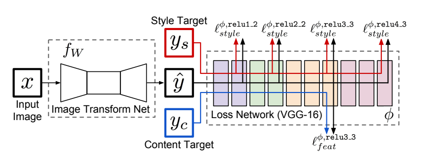
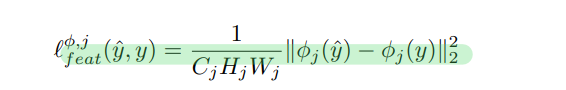
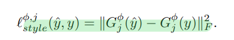
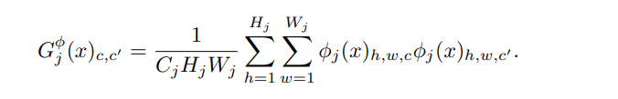

# Perceptual Losses for Real-Time Style Transfer

## 1. 简介：

​	提出了一个图片生成网络，输入输出均为图片。使用感知损失代替像素级损失，并对感知损失进行改善，使用预训练的网络模型来计算损失。

## 2. 模型简介：

论文主要讨论部分为如何定义感知损失函数，使得感知损失能更好的训练。因为基于ImageNet预训练的VGG-16模型对于图像的某些特征有着很好地提取作用，所以可以使用VGG-16中某些特定层的输出来衡量图像的内容特征或者样式特征。

文中以样式迁移为例，提出了样式损失和内容损失，公式如下：

Feature Reconstruction Loss：

Style Reconstruction Loss：

其中，Gram 矩阵是计算每个通道 i 的 feature map 与每个通道 j 的 feature map 的内积。 gram matrix的每个值可以说是代表 i 通道的feature map 与 j 通道的 feature map 的互相关程度。

Gram矩体现了目标的样式特征，所以对于Gram求L2 loss，就是衡量二者样式特征的距离。

